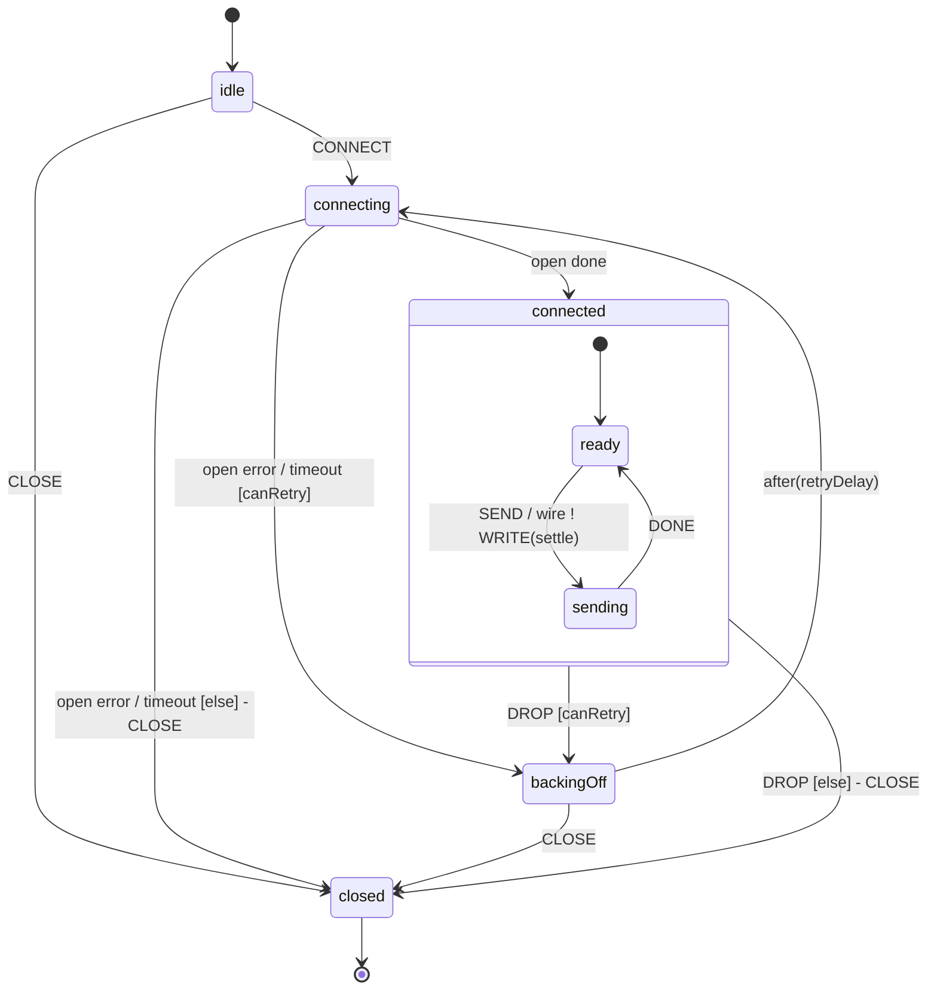

# `@glion/mllp-client` — state-machine rewrite (Approach A)

**Status:** design hardened by verification run `wv2o2rux6` (xstate@5.32.0). The `emit`-based
response bridge was **refuted**; the design now uses a **unified per-call deferred** bridge.
**Date:** 2026-06-05.

## Why

The previous design smeared ownership across three files: lifecycle legality in `state.ts`,
the precondition→throw translation in `client.ts` (`rejectConnect`/`rejectSend`), and the
I/O (read loop, exchange, correlation) in `connection.ts`. The machine _gated_ sends but
never _did_ them, so it was a referee beside the client, not the engine. Errors had no
single home.

**Target:** make the machine the actual engine — it owns connecting, the live wire (read
loop), sending (full write→ACK→correlate→parse), retry, teardown, and **every error
decision**. `MllpClient` becomes a thin typed-Promise facade. One file answers "what happens
on a SEND while sending?" — the transition table in `state.ts`.

## Architecture & module map

```
src/
  state.ts   THE ENGINE: connection machine. Owns lifecycle, legality, retry,
             single-flight, error decisions. Invokes `open` + `wire`.
  wire.ts    the `wire` fromCallback actor (absorbs connection.ts): read loop,
             decoder, single pending-ACK, drop detection. Receives WRITE {…, settle};
             settles the caller's deferred; sendBacks DROP; closes the duplex on stop.
  client.ts  THIN FACADE: MllpClient (connect/send/close as real Promises). Builds a
             deferred, hands its settlers to the machine on the event, returns the promise.
             No lifecycle logic, no error synthesis, no reject* helpers.

reused verbatim:
  errors.ts  MllpClientError + MllpErrorCode (single error vocabulary)
  backoff.ts RetryOptions, backoffDelay (machine calls it in `backingOff`)
  message.ts encodeRequest (outbound codec, at the client boundary)
  ack.ts     parseResponse + MllpClientResponse (inbound codec, in wire)
```

**Seams:**

- `client → machine`: events only — `CONNECT {settle}`, `SEND {framed, controlId, timeout, settle}`, `CLOSE`; reads `getSnapshot().value` for the `state` getter.
- `machine → client`: **the per-call deferred `settle` is the only return channel.** The machine settles it — directly (illegal op → `settle.reject(typedError)`; connect success/failure → resolve/reject) or via the wire (send response/NAK/timeout/drop). The client never reads `context` for outcomes; no `emit`.
- `machine ↔ wire`: `input:{duplex}` in; `WRITE {framed, controlId, timeout, settle}` down; `DROP {error}` up; cleanup (cancel read loop, reject any parked `settle`, `void duplex.close()`) on exit from `connected`.
- `client → adapter`: `MllpConnector`/`MllpDuplex` unchanged; the machine's `open` actor calls it.

## Verification findings baked into this design (`wv2o2rux6`, xstate@5.32.0)

1. **`emit` as the send/connect request-response bridge — REFUTED.** `emit` is a fire-and-forget
   observer channel: no correlation, no timeout, no per-call matching; not an RPC primitive.
   `connection.ts` already rejects it ("XState gives no request/response primitive"). → We use a
   parked deferred instead.
2. **`fromCallback` long-lived wire — HOLDS, cleanup is sync-only.** The cleanup function runs
   synchronously on `XSTATE_STOP`; once stopped, `sendBack` is silently dropped. → The wire must
   cancel its in-flight read and reject the parked `settle` _inside_ cleanup, then fire-and-forget
   `void duplex.close()` (trusting the adapter's MUST-resolve/idempotent contract).
3. **invoke-on-entry / stop-on-exit — HOLDS, `stopChild` is deferred.** The child stop executes
   after the current macrostep. → Don't treat `connected` exit as instantaneous socket teardown;
   teardown is driven by the wire's own cleanup, and `duplex.close()` is idempotent.
4. **Synchronous `emit` to a pre-registered `on()` — HOLDS but unused.** Even though a precondition
   `emit` would be caught, we don't use `emit` at all; precondition rejections ride the same
   deferred as the success path (uniform, no timing subtlety, no late-subscriber footgun).

## State machine

**Context:** `{ options: RetryOptions, connectTimeoutMs, open: OpenConnection, attempt, duplex|null, connectSettle: Settle|null }`.
`connectSettle` is the in-flight connect's deferred, held across `connecting`↔`backingOff` until
resolved/rejected. **No `error` is stored in context** — errors are thrown through `settle`, never parked.

**Events:** `CONNECT {settle} | SEND {framed, controlId, timeout, settle} | DROP {error} | CLOSE`.
(`DROP` arrives from the `wire` child via `sendBack`. The send response does NOT come back as an
event — the wire settles the caller's `settle` directly.)

`type Settle = { resolve(value): void; reject(error): void }` — the per-call deferred's settlers.

**Actors:**

- `open` = `fromPromise<MllpDuplex, {open}>` — opens one connection honoring the abort signal; closes an orphan if it wins a race against CLOSE/timeout.
- `wire` = `fromCallback` — invoked in `connected`. Owns the socket for that state's lifetime: read loop, decoder, single pending-ACK, drop detection.

**States:**

- `idle` — `CONNECT → connecting` (store `connectSettle`); `CLOSE → closed`; `SEND → ({event}) => event.settle.reject(NOT_CONNECTED)` (stay).
- `connecting` — invokes `open`. `onDone → connected`; `onError → backingOff [canRetry] / closed [else]` (on `closed`: `connectSettle.reject(CONNECT_FAILED)`); `after(connectTimeout) →` same routing (CONNECT_TIMEOUT); `CLOSE → closed` (`connectSettle.reject(CONNECT_ABORTED)`); `SEND → settle.reject(NOT_CONNECTED)` (stay).
- `connected` (compound, `entry: [resetAttempt, connectSettle.resolve()]`, invokes `wire`):
  - `ready` — `SEND → sending` (forward `WRITE {…, settle}` to wire).
  - `sending` — wire settles the caller directly; `DONE → ready` (a bare signal from the wire that the exchange settled, releasing single-flight); `SEND → settle.reject(SEND_IN_PROGRESS)` (stay).
  - parent: `DROP → backingOff [canRetry] / closed [else]`; `CLOSE → closed`. (A send in flight is rejected by the wire's own teardown, not here.)
- `backingOff` — `after(retryDelay) → connecting` (`entry: incrementAttempt`); `CLOSE → closed` (`connectSettle.reject(CONNECT_ABORTED)`).
- `closed` (final) — `CONNECT → settle.reject(CLOSED)`; `SEND → settle.reject(CLOSED)`.

> **Single-flight release.** The wire settles the caller's promise directly (it holds `settle`),
> but the machine still needs to leave `sending`. The wire emits one bare `DONE` `sendBack` after
> it settles (resolve OR reject), moving `sending → ready`. `DONE` carries no payload — the value
> already went straight to the caller. This keeps the response value off the event bus (finding 1)
> while keeping single-flight a first-class state.



## Data flow

- **connect():** `new Promise((resolve,reject) => machine.send({type:"CONNECT", settle:{resolve,reject}}))`. Machine stores `connectSettle`, invokes `open`; on success enters `connected` (invokes `wire`) and runs `connectSettle.resolve()`. On failure/timeout/abort/retries-exhausted the machine runs `connectSettle.reject(typedError)`.
- **send(msg):** facade encodes msg → `{framed, controlId, timeout}` at the boundary; `new Promise((resolve,reject) => machine.send({type:"SEND", framed, controlId, timeout, settle:{resolve,reject}}))`. Legal → `sending`, forwards `WRITE {…, settle}` to wire; wire writes, awaits the matching frame, parses, `settle.resolve(response)` (or `settle.reject` for NAK `AckException` / timeout / drop), then `sendBack(DONE)`. Illegal → the originating state runs `settle.reject(typedError)`.
- **drop (peer):** wire detects EOF/`closed`/decoder error → rejects any parked `settle(DROPPED)` and `sendBack(DROP{error})`. Machine leaves `connected` → wire stopped → `backingOff`/`closed`.
- **close():** `send(CLOSE)`. Machine → `closed`; wire stopped; its cleanup rejects any parked `settle(CLOSED)` and closes the duplex.

## Error handling — the core of the rewrite

**The machine owns _which_ error; the deferred is _how_ it reaches the caller.** Every failure and
every illegal operation rejects the caller's `settle` with a typed `MllpClientError` (or an
`@glion/ack` `AckException` for a NAK). The facade is a pure adapter:

```ts
send(message, opts = {}): Promise<MllpClientResponse> {
  const { framed, controlId, timeout } = encodeRequest(message, opts.timeoutMs ?? this.#sendTimeoutMs);
  return new Promise((resolve, reject) => {
    this.#machine.send({ type: "SEND", framed, controlId, timeout, settle: { resolve, reject } });
  });
}
```

The machine constructs every error in an action: illegal `SEND`/`CONNECT` → the originating
state's handler rejects `event.settle` with `NOT_CONNECTED` / `CLOSED` / `SEND_IN_PROGRESS`;
connect failure paths reject `connectSettle`; the wire rejects the parked `settle` for
NAK/timeout/drop. `rejectConnect`/`rejectSend` are **deleted**, and **no error is parked in context**.

**Cost (accepted):** events carry the `settle` callbacks ("smuggling resolve/reject through
events"). This is internal-only — these events are never serialized or replay-debugged — and the
verification's own recommendation (the machine must settle the caller's deferred) requires it.

## Public API (unchanged surface)

`MllpClient` keeps `connect(): Promise<void>`, `send(msg, opts?): Promise<MllpClientResponse>`,
`close(): Promise<void>`, `[Symbol.asyncDispose]`, and `host`/`port`/`state`/`connected`
getters. `SendInput`, `MllpDuplex`, `MllpConnector`, `MllpClientOptions`, `MllpSendOptions`
unchanged.

## Testing

- **wire.test.ts** (new): the `fromCallback` actor in isolation against a fake duplex — write/ACK round trip via a passed `settle`, late-frame buffering, send timeout + slowloris reset, peer drop (EOF / `closed` / decoder error), unsolicited-frame flood cap, cleanup cancels the read loop + rejects the parked `settle` + closes the duplex.
- **state.test.ts**: drive the machine via events with fake `settle`s; assert which typed error each illegal/failed op rejects with, and the phases; retry/backoff routing; `DONE` releases single-flight; `CLOSE` from every live state; no double-settle.
- **client.test.ts**: the facade end-to-end over a fake connector — connect/send/close Promises resolve/reject with the right typed errors; NAK → `AckException`; single-flight rejection (`SEND_IN_PROGRESS`).
- **node.test.ts**: unchanged adapter integration.

## Sharp edges to verify explicitly (from `wv2o2rux6` §4)

1. **Illegal/late send rejection** rides the deferred: SEND in `idle`/`backingOff`/`closed`/`sending` rejects with the exact typed `MllpClientError` (no hang, no reliance on `emit` timing).
2. **`sendBack` after `connected` exit is dropped, and the in-flight send fails deterministically:** force exit (peer DROP or `close()`) mid-ACK → the parked `settle` rejects (DROPPED/CLOSED), and a frame arriving from the now-stopped wire is ignored.
3. **Wire cleanup cancels the read loop before returning + idempotent duplex close:** stop the wire mid-read → no further `sendBack`, read loop cancelled, `duplex.close()` effectively once even if exit and an error path both trigger teardown.
