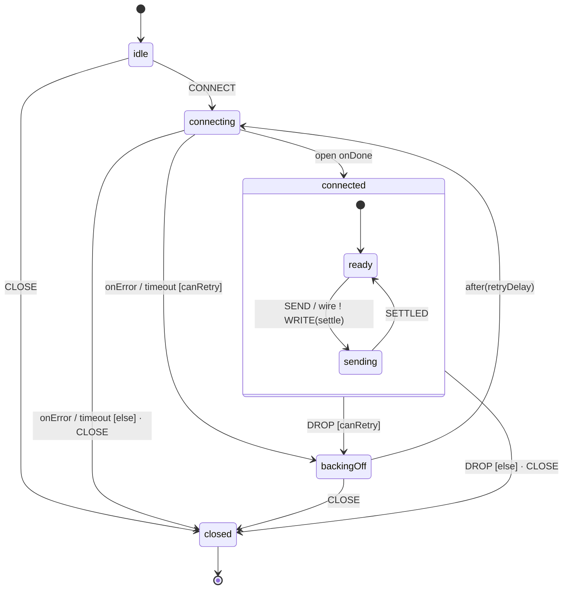
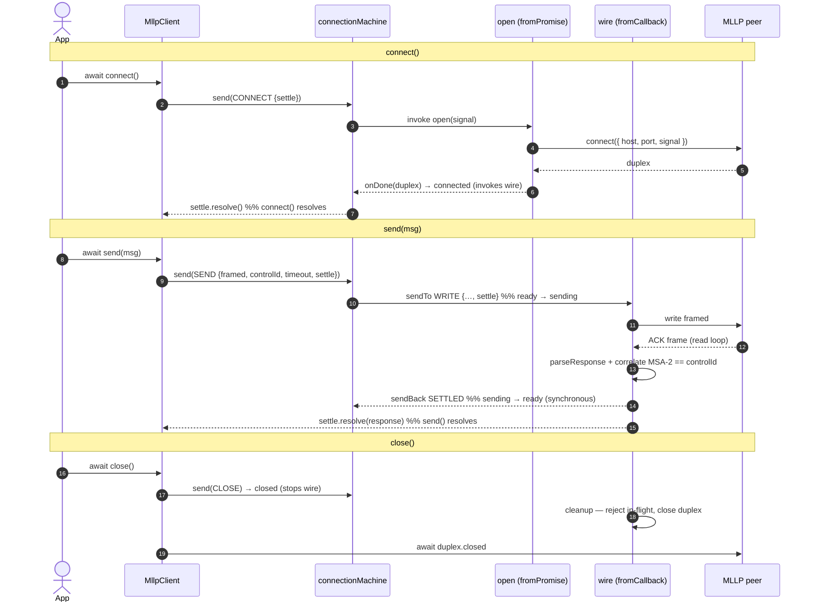

# `@glion/mllp-client` — architecture

**The machine is the engine.** The XState machine (`state.ts`) owns the connection
end-to-end: the lifecycle (connect, retry/backoff, close), single-flight sending,
teardown, and **every error decision**. It links to async I/O through invoked
actors — `open` (a `fromPromise`) and `wire` (a `fromCallback` that wraps the
`connection.ts` engine: read loop, decoder, single-flight ACK deferred, drop
detection). The per-send exchange is _not_ its own actor (the ACK arrives on the
wire's single reader, so a per-send promise could never be fed the frame); it
stays a deferred inside the wire. `MllpClient` (`client.ts`) is a thin facade.

**The result bridge.** XState is tell-not-ask and `emit` is not a request/response
channel, so a caller's deferred travels with the request: `connect()` / `send()`
hand the machine a `settle` (`{resolve, reject}`). The machine settles it —
directly for an illegal or failed operation (it constructs the typed
`MllpClientError`), or via the wire for a send's ACK / NAK / timeout / drop.
Nothing is parked in `context`; there are no `reject*` helpers.

## Lifecycle

`connected` is compound (`ready` / `sending`) — single-flight as a state: `SEND`
is legal only in `connected.ready`, so a `SEND` while `sending` rejects its
`settle` with `SEND_IN_PROGRESS`. Every illegal or failed operation rejects the
caller's `settle` with a typed error chosen by the machine.

(`backingOff` is unreachable until retry is enabled — the client default is
`NO_RETRY`.)

## Happy path — connect → send → close

**Unhappy paths.** A failed/timed-out connect rejects `connect()`'s `settle`
(`CONNECT_FAILED` / `CONNECT_TIMEOUT`), or routes to `backingOff` when retry is
enabled; `CLOSE` mid-connect rejects with `CONNECT_ABORTED`. A peer drop has the
wire `sendBack` `DROP` (→ `backingOff`/`closed`) and reject the in-flight send
with `DROPPED`; a send timeout rejects with `SEND_TIMEOUT` and stays connected; a
NAK rejects with an `@glion/ack` `AckException`.

## Promotion path

While the message protocol is single-request/single-ACK, the message lifecycle is
the `connected.{ready, sending}` substate (Design Philosophy §1 — no premature
abstraction). When it grows richer — two-tier ACK (`OnCommit` → `OnApplication`),
per-message retry, or multi-flight — promote it to an invoked child `session`
machine. The `open`/`wire`/exchange wiring is unchanged by that promotion, so it
is a localized, low-risk change.
